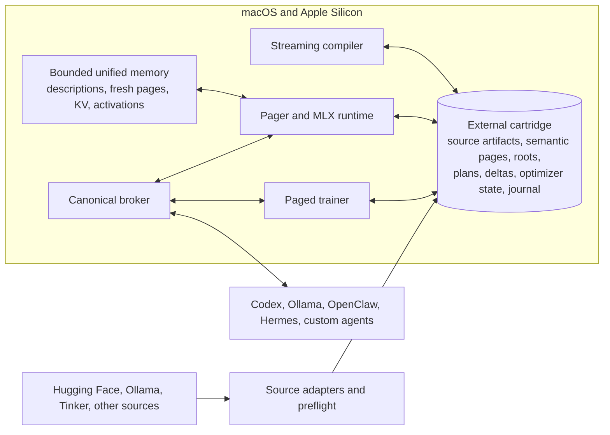

# Cassette

Frontier-class language models are already public, downloadable, and still beyond the machines most
people own. The pinned Kimi K3 exemplar occupies about 1.56 TB, while its native text path addresses
roughly 139.4 GB of weights per token before KV state, activations, and runtime reserve. An external
drive can hold those bytes. Ordinary offloading cannot make the Mac consume them quickly enough.

Cassette is an open-source system for changing that relationship. A user selects a complete model
from Hugging Face, Ollama, Tinker, or another supported source; Cassette writes the authoritative
model directly to an external USB-C flash or SSD cartridge, prepares the least invasive usable
representation, executes it through Apple Silicon with a mathematically certified bounded frontier
in unified memory, and serves it to Codex, Ollama, OpenClaw, Hermes, or a custom agent endpoint.
Compatible models can be fine-tuned or post-trained where they sit. The full checkpoint does not
move onto internal storage, and no hosted model answers behind the curtain.

> [!IMPORTANT]
> Cassette is being built in public. The research and governance foundation and S01–S24 are
> complete. The repository now executes its storage, acquisition, compilation, paging, inference,
> broker, adapter, training, export, update, repair, and revision-removal paths against deterministic
> generated or checked-in fixtures on scratch cartridges. The latest S24 closeout passed all 172
> repository tests and the structural ledger with no violation.
>
> S25 is next. No PHASE MACHINE step has downloaded a live model, contacted a live model service,
> touched a physical external drive, or established F4/F5 quality, scale, or service performance.
> Cassette is not yet a user-ready release, and the complete release matrix remains `NOT_RUN`.

## The complete product operation

The product boundary is one continuous machine operation:

1. An agent or control surface supplies a source descriptor for a complete downloadable model.
2. Cassette inspects immutable metadata, model geometry, license evidence, required operators,
   semantic assets, cartridge capacity, and the target hardware profile before transferring the
   payload.
3. The source artifacts stream directly to the external cartridge with resumable, digest-verified
   acquisition. No full checkpoint is staged on the Mac's internal drive.
4. Cassette chooses the least invasive representation that passes the declared memory, performance,
   capability, quality, and mathematical-certificate gates. If native execution cannot pass,
   Cassette compiles a separately identified storage-native revision whose complete relationship to
   the source and protected conditions remains provable.
5. During inference, the cartridge retains authority over the model while Apple unified memory holds
   only the admitted descriptions, certificate metadata, exact or fresh-correction pages, context
   state, activations, and reserve.
6. The same callable revision is exposed through one canonical broker and thin conformance adapters
   for the named agent systems.
7. When a model supports training, Cassette keeps the base, deltas, optimizer state, checkpoints,
   journals, and resulting child revision on the cartridge and returns that child through the same
   agent interfaces.

A button, prompt, or UI may eventually start or inspect this work. Cassette is not defined by that
surface. The invention belongs in the model representation, storage path, runtime, training path,
and proof machinery underneath it.

## What Cassette is—and is not

| Cassette | The substitute it rejects |
|---|---|
| The external cartridge is the authoritative model and training store. | A conventional Mac-resident installation that uses the drive as an archive, cache, or download folder. |
| Runtime inference and training are local to Apple hardware and the cartridge. | A remote API whose answer is presented as local execution. |
| Model structure and physical access are changed when the hardware hierarchy requires it. | Ordinary memory mapping, swap, or layer-by-layer offload presented as the contribution. |
| Kimi K3 names the frontier level and supplies a pinned evidence anchor. | A conveniently smaller model substituted for the stated achievement. |
| Hardware support is expressed as measured Apple, storage, transport, filesystem, and thermal classes. | A product hard-coded to Drew's Mac, one LaCie drive, or the words “USB-C.” |
| A complete source-to-agent operation, including compatible on-cartridge training. | A paper, simulator, benchmark harness, small-model demonstration, or UI standing in for the product. |
| Minimum original executable code after correctness is satisfied. | Missing functionality renamed as simplicity. |

The one-time compilation of a frontier cartridge may use recorded external compute for teacher
tracing, transformation, and recovery training. That exception does not extend to use of the
cartridge: inference and training at runtime remain local, and every transform produces a new,
verifiable model identity.

## The storage-native design

The complete architecture is deliberately narrow. Python owns the control plane, MLX owns generated
Apple tensor execution and trainer autograd at one pinned version, and existing numerical
primitives outrank new kernels. The external cartridge is the durable meeting place between
otherwise separate components.



The representation decision follows a fixed order: byte-identical layout, exact native sparsity,
exact quantization or layout conversion, predictive prefetch with native routing, and only then a
separately identified compiled revision. A native model is never transformed merely because
transformation is interesting; an earlier mode must fail its acceptance contract first.

The compiled foundation is defined in [MATHS.md](MATHS.md). For a target tensor or operator $T$, a
declared condition $v$ supplies a relevance metric $C_v$. Cassette asks which rank-bounded atoms can
serve which condition sets at tolerance $\eta$:

$$
K_{\eta,r}=\left\{S:\exists A\ne0,\ \operatorname{rank}(A)\le r,\
\ell_v([A])\le\eta\ \text{for every }v\in S\right\}.
$$

This is a simplicial complex, not a top-$k$ list. Its minimal nonfaces record higher-order
incompatibilities, and the least atom count is the weak chromatic number of that minimal-nonface
hypergraph. Every compiled plan must then price a separate execution problem: resident description
bytes, certificate metadata, exact or fresh randomized correction traffic, execution error and
risk, composition through the declared trace horizon, and the observation contract used to select
an atom. A shared core and request-fixed pages remain possible descriptions. They are no longer the
foundation by assumption.

Two physical inequalities govern every plan:

$$
W_{cert}(r,t) + C_{desc}(t) + K(r,t) + A(t) + R \le M
$$

$$
L_d \ge \max\left(\frac{D_{miss}}{B_s},\frac{H_{mem}}{B_m},\frac{F}{C_{compute}}\right)
$$

The first keeps certified fresh pages, resident descriptions and metadata, context, activations,
and reserve inside the admitted unified-memory budget. The second refuses to call a plan fast when storage traffic, memory traffic, or
compute already proves otherwise. Applying that bound to native Kimi K3 yields a 5.87 token/s
ceiling even at the specified 819 GB/s memory-bandwidth ceiling of the matrix's 512 GB teacher
class. On the 32 GB consumer class, a ten-token/s decode requires no more than 15.3 GB touched per
token at impossible 100% utilization, or about 10.7 GB at 70%. This is a physical traffic bound,
not evidence for one decomposition. Cassette must change the active path;
it cannot stream the unchanged 139.4 GB path and negotiate with arithmetic afterward.

## Cartridge authority

One logical model may have source, executable, tuned, and exported revisions, but each revision has
one canonical identity and one provenance graph. The identity covers immutable source revision,
artifact paths, sizes and digests, format versions, tensor index, configuration, architecture,
operators, tokenizer, processor, template, precision, license, parents, and transform manifest.
Mutable labels such as `main`, `latest`, or a filename may locate material; they cannot identify it.

The canonical cartridge representation separates meaning from placement:

- semantic parameter payloads are content-addressed pages of at most 4 MiB;
- immutable segments contain ordered pages and remain at or below 1 GiB;
- `TensorMap` spans reconstruct tensors independently of segment order;
- a fixed-record physical index maps page identities to the current segment layout;
- immutable roots bind identity, provenance, semantic assets, tensor maps, operators, plans, deltas,
  and integrity evidence;
- hardware plans may differ without duplicating the underlying weight pages;
- atomic generations decide which immutable root is callable without exposing a mixed revision to
  readers.

This separation permits repacking for a different access pattern without changing the logical model
root. It also gives training a place to append adapters, replacement pages, optimizer state, and
child revisions without mutating the verified parent.

## Capability and user-experience contract

Cassette is not required to impersonate a datacenter by ignoring physics. It is required to deliver
frontier-class value on the consumer machine and to report the rest of the distance honestly. Each
release row freezes three comparisons:

- $B_{native}$: the strongest open model the same Mac can run unaided;
- $B_{teacher}$: the selected model's own full-capacity reference execution;
- $B_{hosted}$: the laboratory service where an equivalent interface exists.

The headline compiled-frontier row must pass all of these service floors:

| Agent-visible measure | Required floor |
|---|---:|
| Warm p95 first committed token | at most 5 s |
| Cold p95 first committed token | at most 15 s |
| Warm p95 decode latency | at most 100 ms/token |
| Sustained decode | at least 10 tokens/s |
| Operation error rate | at most 0.5% |
| Qualified-session availability | at least 99.5% |

It must also beat $B_{native}$ with a lower 95% confidence bound of at least 1.05 overall and 1.15
on long-tail and capacity strata, avoid regression on every critical stratum, and close more than
half the measured capability gap from $B_{native}$ to $B_{teacher}$. First-token latency, decode,
throughput, task time, quality, long-tail behavior, tails, and thermal decay are published against
the teacher and hosted references even when the result is unfavorable. `PARITY` or
`NEAR_LABORATORY` is an additional label, never a substitute release threshold, and the software
may emit it only when its stricter ratios pass.

The full parameter capacity must remain present, reachable, and consequential. A compiler therefore
emits a total source-to-executable contribution map; lossy transforms classify every source
contribution as represented, merged, quantized, or conditionally selected, while omission is a
structural failure. Quality from a smaller surrogate cannot satisfy that proof.

## Training where the model lives

Not every model or optimizer suits drive-resident training, and Cassette says so before starting.
The first release requires bounded adapter and recovery operations on compatible compiled rows:
LoRA or adapter SFT, offline DPO, adapter continued pretraining, recovery and calibration of the
compiled condition/atom/description/estimator certificate, and precision-tier recovery. Each job
must reserve storage, memory, sustained bandwidth, write endurance, power, thermal duty, and
completion time before it changes a byte.

The exclusion is mathematical rather than ceremonial. FP16 or BF16 parameters with two FP32 Adam
moments require at least 10 bytes of persistent state per parameter; an FP32 master raises that to
14 bytes before journals or checkpoints. At Kimi K3 scale, those two cases exceed about 27.2 TB and
38.1 TB. A 2 TB cartridge must reject that operation, while a bounded adapter may remain admissible.

During an admitted job, one deterministic parameter and state window moves from the cartridge into
unified memory, advances through the forward and backward dependency frontier, and returns to a
candidate child revision on the cartridge. Interrupt, cancellation, disconnect, low capacity,
invalid gradients, and remount must recover either the exact parent or the exact committed child;
there is no partially callable model and no hidden full master on internal storage.

## Current implementation

The numbered implementation queue is complete through S24. The repository contains an executable
machine scaffold and a deterministic interoperability system, not a user-facing Cassette release.
Every result below is fixture-scale unless the row says otherwise.

| Step | State | Implemented result |
|---|---|---|
| S01 | Done | Reproducible partial $J$ accounting, dependency and interpreter pins, import-layer checks, generated-file checks, test citation checks, and commit-law enforcement. |
| S02 | Done | One closed `CassetteError` vocabulary and exact five-field machine payload. |
| S03 | Done | Generated Draft 2020-12 contracts, one generated validator, and regeneration-based hand-edit detection. |
| S04 | Done | Canonical Q1 identity with alias convergence, immutable-evidence requirements, single-byte divergence, parent and transform binding, BLAKE3, and RFC 8785. |
| S05 | Done | SafeTensors and GGUF import, content-addressed pages and bounded segments, representation-independent indexes, exact tensor-span reads, root generations, repacking, deltas, export material, and verified integrity roots. |
| S06 | Done | Durable transaction journal, immutable root generations, process-kill injection, reader isolation, rollback, and APFS remount proof. |
| S07 | Done | Full integrity and repair state machine, exact capacity reservation across all operation classes, parity repair, and exact unavailable-page admission. |
| S08 | Done | Removable-cartridge lifecycle, identity revalidation, read-only handling, and stale-access rejection. |
| S09 | Done | Stateless five-operation source boundary with credential-authority and hostile-redirect repair. |
| S10 | Done | Resumable direct-to-cartridge transfer with bounded ranges, durable SHA-256 continuation, and corruption/drift rejection. |
| S11 | Done | Evidence-bound metadata normalization and four-outcome preflight that derives strong trust from verified bytes. |
| S12 | Done | MATHS.md-controlled bounded certificate dimensions, generated Q30 dispatch, ten independently checked MLX golden operator rows, and repository-owned native-link rejection. |
| S13 | Done | Independent Q19 certificate recomputation, exact contradiction refusal, memory admission, and certified residency scheduling. |
| S14 | Done | Native and compiled route binding, verified page readiness, seeded fresh correction, cancellation and timeout boundaries, and one fenced MLX submission. |
| S15 | Done | One complete protected tiny decoder with exact prefill, fresh one-token decode, nonlinear graph execution, committed K/V state, and exhaustive correction outcomes. |
| S16 | Done | Canonical broker operation state machine, durable event ownership, replay, cancellation, pause, and publication boundaries. |
| S17 | Done | Scheduler, leases, generated capability negotiation, and byte-denominated page-cache admission against canonical roots. |
| S18 | Done | Thin, generated, hostile-wire adapters for Codex, Ollama, OpenClaw, Hermes, and custom clients without a second execution authority. |
| S19 | Done | Contained streaming compilation from verified source bytes, source-to-executable contribution maps, independent mathematical witnesses, and broker-to-compiler publication. |
| S20 | Done | Generated and independently reconstructed hardware-plan catalogs whose physical policies can change without duplicating weights or changing executable identity. |
| S21 | Done | Real fixture-scale Tier-A adapter training and Tier-B certificate-recovery primitives with frozen parents, durable checkpoints, and independent unpaged oracles. |
| S22 | Done | Training preflight, exact reservation, endurance and thermal admission, checkpoint metering, pause, recovery, and typed terminal refusal. |
| S23 | Done | Generated 128-coordinate failure authority with durable-frontier and lifecycle preflight proof; concrete eight-operation replay remains assigned to S26. |
| S24 | Done | Deterministic source-to-compiler replay, protected teacher traces, full and adapter export/re-import, named-adapter calls, exact revision deltas and rollback, and independently proved revision removal. |

The remediated S24 tree passed all 172 tests on arm64 macOS. The clean ledger reported 9,439
product lines, 6,949 test lines, 615 tool lines, and 109 generated lines, with five exact direct
dependency pins, one process, and one authored language. Ten Q26 and Q54 refusal guards were also
removed one at a time; each removal failed the fixture that names its contract.

The boundary remains physical and explicit. PHASE MACHINE has used deterministic model fixtures,
loopback source servers, scratch cartridge images, and simulated recorded storage classes. It has
not made a live source request, downloaded a selected model, inspected attached storage or a local
model cache, touched a physical external drive, or measured a real model against its laboratory
reference. S25 must now prove invalidation, deterministic certified compilation, Tier-A and Tier-B
integration, and resource-frontier curves on fixture material. S26–S28 close the machine before
PHASE LIVE begins. No UI has been built.

## Build path

The implementation proceeds in dependency order and does not promote diagnostic artifacts into a
release:

1. **S01–S05 — governed representation, done:** accounting, errors, generated contracts, immutable
   identity, and the storage-native cartridge format.
2. **S06–S11 — durable cartridge and acquisition boundary, done:** transactions, repair, capacity,
   removable-media lifecycle, source adapters, resumable transfer, metadata trust, and preflight.
3. **S12–S15 — certified execution, done:** mathematical contracts, generated MLX dispatch,
   independent certificate validation, page readiness, stochastic correction, and a complete tiny
   decoder from cartridge pages.
4. **S16–S18 — agent service boundary, done:** canonical operations, leases, negotiation, and thin
   named-client adapters.
5. **S19–S20 — compiler and hardware plans, done:** contained streaming transforms, complete
   contribution maps, mathematical witnesses, replaceable physical plans, and profile selection.
6. **S21–S22 — drive-resident training machinery, done at fixture scale:** paged optimization,
   certificate recovery, metering, resource admission, checkpoints, interruption, and recovery.
7. **S23–S24 — failure authority and machine interchange, done:** generated failure coordinates,
   protected teacher traces, export/re-import, agent calls, revision deltas, and exact removal.
8. **S25 — next:** deterministic invalidation closure, independently certified end-to-end fixture
   compilation, both training tiers, and mathematical resource-frontier curves.
9. **S26–S28 — machine closeout:** concrete failure replay through all eight operations, final $J$
   and removal proof, and the generated PHASE LIVE runbook.
10. **L01–L05 — one live campaign after S28:** qualify real storage classes, acquire real pinned
    models, execute the 3–8B and 20–120B gates, run frontier training, protocol, failure, offline,
    and privacy rows, and produce one reproducible Q80 completion digest.

F4 and F5 remain PHASE LIVE gates and are deliberately useful without being allowed to masquerade
as completion. F4 asks a permissively licensed 3–8B dense model to cover its frozen protected
conditions, carry an
independently recomputable Q19 certificate, pass its mandatory Tier-A training and Tier-B
certificate-recovery rows, preserve at least 95% of teacher quality, and touch no more than one
quarter of its native active bytes. F5 repeats the predicates and both training tiers at 20–120B
scale and must predict a feasible point inside the consumer decode budget.
Failure records a Q38 falsification and changes the mechanism before expensive frontier work begins;
passing merely permits that work to begin.

## Research and acceptance

The build rests on eighty closed first-principles questions across sixteen directions: identity,
capacity preservation, Apple memory and compute, storage and transport, acquisition, cartridge
format, inference, compiled compatibility and execution, training, durability, protocols, minimum code, provenance,
evaluation, full-scale qualification, and demonstrated contribution. `CLOSED` means the research
packet contains one build decision, formal contract, evidence basis, instruction, acceptance check,
and exact reopen condition. It does not mean the corresponding code exists.

Twelve evidence records separate public artifact observations, specifications, measurements,
inferences, and choices. The research used reproducible product classes and immutable public
artifacts; it did not inspect Drew's current Mac, attached drives, model cache, accounts, or client
configuration and call that general evidence. The acceptance matrix expands the final claim across
source services, Apple classes, storage classes, model revisions, workloads, training operations,
named agent protocols, failures, offline execution, privacy, and exact code accounting. Its result
remains `NOT_RUN` until every required live row passes.

## Repository map

| Authority or artifact | Purpose |
|---|---|
| [ORIGINAL_REMIT.md](ORIGINAL_REMIT.md) | Drew Wiberg's binding intent, definitions, boundaries, and completion standard. |
| [MATHS.md](MATHS.md) | Mathematical authority for compatibility geometry, atom capacity, description/probe execution, sequential composition, and observation adequacy. |
| [PHILOSOPHY.md](PHILOSOPHY.md) | Privacy, sovereignty, honesty, provenance, accessibility, and the acceptance rows that enforce them. |
| [research/QUESTION_QUEUE.md](research/QUESTION_QUEUE.md) | The finite eighty-question research queue and its sixteen first-principles directions. |
| [research/RESEARCH.md](research/RESEARCH.md) | The closed implementation decisions, mathematics, build instructions, and reopen conditions. |
| [research/EVIDENCE.md](research/EVIDENCE.md) | Immutable model observations, hardware and format contracts, derived bounds, and falsified claims. |
| [research/ACCEPTANCE_MATRIX.yaml](research/ACCEPTANCE_MATRIX.yaml) | The machine-readable definition of a complete first release; currently `NOT_RUN`. |
| [AGENTS.md](AGENTS.md) | The only repository instruction authority: architecture, minimum-code objective, tests, writes, and commit law. |
| [IMPLEMENTATION.md](IMPLEMENTATION.md) | The ordered and resumable S00–S28 machine phase and L01–L05 live campaign. |
| [BUILD_STORY.md](BUILD_STORY.md) | The attributed human–agent exchange that produced and corrected the specification and build. It is testimony, not a changelog. |
| [errors.py](errors.py) | Canonical typed error vocabulary. |
| [sources.py](sources.py) | Source resolution, credentials, metadata trust, preflight, and resumable direct-to-cartridge transfer. |
| [store.py](store.py) | Identity, content pages, roots, transactions, capacity, lifecycle, integrity, export, delta, and revision-removal authority. |
| [compiler.py](compiler.py) | Contained source interpretation, mathematical certificates, contribution maps, compilation, export planning, and hardware plans. |
| [pager.py](pager.py) | Certified schedules, page readiness, generated MLX dispatch, correction, and committed transformer execution. |
| [trainer.py](trainer.py) | Training admission, paged Tier-A optimization, Tier-B recovery, durable checkpoints, metering, and child material. |
| [broker.py](broker.py) | Canonical operation ownership, scheduling, leases, replay, publication, and component composition. |
| [adapters/](adapters/) | Generated-map protocol translation for the five declared client surfaces. |
| [schema/](schema/) | Generated machine contracts and validator; never hand-edited. |
| [tools/genschema.py](tools/genschema.py) | Sole schema generator. |
| [tools/capture_fixture.py](tools/capture_fixture.py) | Sole protected S24 teacher-trace generator. |
| [tools/ledger.py](tools/ledger.py) | Structural enforcement and partial $J$ accounting. |
| [tests/](tests/) | One acceptance-bound fixture per implemented invariant and stage. |
| [LICENSE](LICENSE) and [NOTICE](NOTICE) | Apache-2.0 terms and Recluse Studio attribution notice. |

## Reproduce the current proof

Cassette currently pins Python `==3.13.*`, `blake3==1.0.9`, `mlx==0.31.0`, `rfc8785==0.1.4`,
`resumablesha256==1.0`, and the development dependency `pytest==9.1.1`. The following commands
create no repository-local environment and reproduce the current isolated checks when copied
verbatim on Apple Silicon macOS:

```bash
PYTHONDONTWRITEBYTECODE=1 uv run --isolated --no-project --python 3.13 \
  --with pytest==9.1.1 \
  --with blake3==1.0.9 \
  --with mlx==0.31.0 \
  --with rfc8785==0.1.4 \
  --with resumablesha256==1.0 \
  python -m pytest -q -p no:cacheprovider

PYTHONDONTWRITEBYTECODE=1 uv run --isolated --no-project --python 3.13 \
  --with pytest==9.1.1 \
  --with blake3==1.0.9 \
  --with mlx==0.31.0 \
  --with rfc8785==0.1.4 \
  --with resumablesha256==1.0 \
  python tools/ledger.py
```

Generated schemas can be reproduced with:

```bash
uv run --isolated --no-project --python 3.13 python tools/genschema.py
```

Do not edit files under `schema/` by hand. The ledger regenerates them in a clean temporary
directory and rejects any byte that the generator does not reproduce.

## Contributing

Cassette is queue-built. Before changing code, read the remit, mathematical authority, research
ledger, acceptance matrix, build rules, and implementation queue; select the first eligible `TODO` step; name the exact
acceptance clause that fails; reuse the pinned runtime or standard library before adding code; and
stop when the smallest credible proof passes. Work outside the current step is a defect, even when
the adjacent work will eventually be necessary.

Every test cites the research or matrix invariant it executes. Every product dependency is exact
and justified by a failing row. Every commit states `Failed before`, `Reused instead of authored`,
and `Deleted`. Model variation belongs in manifests, plans, or generated dispatch data rather than
model-family branches, and a new numerical kernel requires a Q30 admission record.

The project minimizes the following lexicographic objective after correctness:

$$
J = (\text{failed rows},\ \text{new kernels},\ \text{authored executable LOC},\
\text{processes},\ \text{runtimes},\ \text{dependencies},\ \text{model branches},\
\text{duplicate authorities},\ \text{shipped binary bytes})
$$

Tests, fixtures, comments, docstrings, and types do not count as product LOC, but they remain bound
to an acceptance invariant. Dense code written to game the count fails the same objective it is
trying to flatter.

## Build record, license, and origin

Cassette grew through a conversation in which technical answers were repeatedly tested against
the original language, and several attractive substitutions—a Mac-hosted model, one actual drive
as the product target, a paper as the outcome, or a passing suite as proof of every clause—were
removed only after Drew challenged them. [BUILD_STORY.md](BUILD_STORY.md) preserves that exchange
under the exact model that authored each passage, including reviews that reopened completed work
and the replies that narrowed those reviews back to their proper steps.

Cassette is licensed under [Apache License 2.0](LICENSE). Personal and commercial use are permitted
under its terms. Redistributions must preserve the license and any attribution notices required by
Apache-2.0; [NOTICE](NOTICE) identifies Cassette as a Recluse Studio project.

Created and developed by [Recluse Studio](https://recluse.studio).
