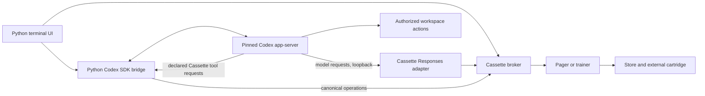

<!-- TUI-IMPLEMENTATION.md — Cassette terminal product contract and scoped delivery order; depends on AGENTS.md, ORIGINAL_REMIT.md, MATHS.md, IMPLEMENTATION.md, PHASE_LIVE_RUNBOOK.md, research/RESEARCH.md, research/ACCEPTANCE_MATRIX.yaml, broker.py, sources.py, store.py, compiler.py, pager.py, trainer.py, adapters/__init__.py, tools/genschema.py, tools/campaign.py, pyproject.toml, docs/tui/precedent/. -->
# Cassette terminal interface

Contract version 1 · 6 September 2026 · implementation NOT_RUN

The user chooses a source and model, connects an account when necessary, selects an external
drive, and acquires a callable revision without managing downloads outside Cassette. In the same
terminal application, the user talks to that model, gives it actions, follows ongoing operations,
and inspects how storage, execution, training, and the agent harness are performing.

The interface is a character-cell terminal program. Its visual quality comes from typography,
alignment, colour, clear state, and useful density. The approved studies establish the direction;
they are not rendered software, measured performance, or proof of backend capabilities.

## 1. Standing, scope, and current evidence

The principal requested this contract and the accompanying visual studies in the side
conversation on 6 September 2026. This authoring does not execute a TUI build step, alter the
running L04 work, change a live-stage result, install an SDK, or admit a new runtime.

Authority order:

1. The principal's explicit directions, including a pure terminal interface, macOS support,
   first-class Omarchy Quattro interface support, integrated acquisition, dashboards, and Codex SDK research.
2. `AGENTS.md` for implementation ownership, dependency admission, accounting, and proof discipline.
3. `ORIGINAL_REMIT.md`, `MATHS.md`, and the research contracts for product and mathematical claims.
4. `IMPLEMENTATION.md` for the main build and live campaign order and state.
5. This file for terminal surfaces, their acceptance obligations, and the T01–T08 sub-plan.
6. The images for visual precedent. Written controls, states, units, and ownership win over an image.

T01–T08 are terminal delivery identifiers, not replacements for L01–L10. The principal can request
`execute T01` explicitly. They do not become additional live campaign gates by being listed here.
Before a T step changes a shared backend, reconcile its dependency with the current main queue
and active work; preserve accepted backend behavior and cite the owning Q contract. This file
records only T statuses. Main-stage status remains solely in `IMPLEMENTATION.md`.

### Source inspection baseline

These are source observations on an actively changing worktree, not new executed results:

| Surface | Observed source | Consequence for this contract |
|---|---|---|
| Native terminal application | No TUI entrypoint or terminal UI dependency was found in the inspected product/configuration | T01 supplies the first usable shell; illustrations remain proposals |
| Acquisition | `sources.py:SourceAdapter`, `broker.py:CanonicalBroker.run_acquisition`, store-granted transfer extents | Reuse these authorities; catalogue search and credential interaction still need a user path |
| Chat and streaming | `CanonicalBroker.generate_native`, `stream_client`, `listen`, generated adapter maps | A TUI can be wired to real committed execution; compatibility with the exact Codex runtime needs its own proof |
| Actions | `CanonicalBroker.native_capability` currently declares `generated_calls: False` | T04 must implement and prove the model/tool/result round trip; definitions in a prompt are insufficient |
| Training | `CanonicalBroker.train_native` and trainer/store checkpoints | Controls and observations bind real job identities, candidate revisions, and committed boundaries |
| Campaign observations | L04 is implementing `tools/campaign.py` and related controls | T06 consumes its accepted records; unfinished L04 code is not an accepted telemetry interface |
| Platform | Current execution/durability authority is Apple Silicon, MLX, macOS, APFS | Omarchy frontend parity does not prove Linux-local model execution |
| SDK | No Codex SDK dependency in inspected `pyproject.toml` | T03 owns exact-version qualification and the scoped process/accounting admission |

No TUI test, Codex-to-Cassette turn, terminal accessibility test, Omarchy runtime test, or physical
drive journey was executed during this authoring. Reinspect named symbols before implementation;
the main task is continuing independently.

### Platform boundary

The same Python terminal presentation and interaction code must work on macOS and Omarchy Quattro.
Use terminal cells and capability detection, not macOS window APIs, browser rendering, or
Omarchy shell components. Platform-dependent drive discovery, credential storage, and resource
measurement have explicit implementations and report unavailable fields honestly.

Mac-local execution is the initial full product path. Omarchy is a required frontend target with
the same navigation, editing, state rendering, and recovery behavior. Linux-local model execution
and non-APFS cartridge durability remain a separately admitted backend port under Q30/Q41–Q44;
T07 records that boundary and may not advertise them as working. An Omarchy frontend fixture is
not a remote-inference pass, and no remote backend is silently added to satisfy parity.

## 2. Visual and terminal contract

### Precedent register

| ID | Study | Governing surface |
|---|---|---|
| V01 | [Library](docs/tui/precedent/01-library.png) | Source selection, catalogue and machine/drive context |
| V02 | [Account](docs/tui/precedent/02-account.png) | Public access and credential connection |
| V03 | [Transfer](docs/tui/precedent/03-transfer.png) | Direct-to-drive acquisition and verification |
| V04 | [Overview](docs/tui/precedent/04-overview.png) | Whole-application observations and drill-down |
| V05 | [Run](docs/tui/precedent/05-run.png) | Conversation, composer, action inspection |
| V06 | [Operation](docs/tui/precedent/06-operation.png) | Training progress, interruption and recovery |

Prompts and generation provenance live beside the images in `PROMPTS.md`. All model names,
capacities, rates, losses, timestamps and states in the studies are illustrative. They choose no
F4 model and establish no default performance tier. Graph tick placement and drawn bar lengths
are visual suggestions; implementation plots must derive every coordinate from their values.

The original three studies used a top-level Transfers tab. The expanded shell below supersedes
only that navigation detail: Transfers becomes the acquisition filter within Operations, reached
directly after starting a download. The accepted source/account/transfer layouts remain precedent.

| Token or rule | Requirement |
|---|---|
| Background | Flat charcoal `#191b19`; no gradients, transparency, glow, texture, or wallpaper dependence |
| Foreground | Ivory `#d8d4c5`; secondary readable gray-green `#979e8e` |
| Accent / selection | Copper `#ca9870`; olive `#a8b889`; selection also has a textual cursor or reverse video |
| Rules | Muted `#485047` box-drawing cells; never use colour alone to identify a boundary or status |
| Type | IBM Plex Mono reference; respect the terminal's configured monospaced font and scale |
| Size | One character grid; never shrink text to fit. Reference captures use at least 14-pixel text. The application does not control terminal font pixels |
| Graphics | Unicode box drawing, blocks and braille; ASCII alternatives for every graph and control |
| Interaction | Every action is keyboard accessible. Mouse support is supplementary; no mandatory Nerd Font, image protocol, browser, or web runtime |
| Theme | Terminal-default/ANSI palette mode plus Cassette palette. Read colours as data; never execute theme scripts or overwrite terminal configuration |
| Motion | No decorative animation. Coalesce redraws; static reduced-motion and append-only text modes retain all task information |

Prefer Python's `curses`/terminfo support and `asyncio` before admitting a TUI framework. Curses
provides portable character-cell rendering and incremental screen refresh [R4]. T01 must test
Unicode editing, paste, colour fallback, resize, and terminal restoration on the actual pinned
interpreter. Admit a library only for a reproduced acceptance failure with its exact subset,
version, licence, and J cost; a visual preference alone is not a dependency record.

### Frame and navigation

Proposed entry: `cassette tui`. The packaging entrypoint is created in T01, not assumed to exist.
The first launch opens **Library** with **Select drive** visible. Subsequent launches restore the
last safe view; they never start a model, download, or job merely because a view was restored.

Persistent navigation order: **Overview · Library · Run · Operations · Drive · Settings**.
Header: current destination, selected model when relevant, execution host, selected drive,
and live connection state. Footer: controls available in the focused pane and one short status.

| Geometry | Behavior |
|---|---|
| At least 140 columns × 40 rows | Three-pane library; transcript plus action inspector; multi-column overview |
| 100–139 columns, at least 30 rows | Two panes; secondary details open with `i`; no clipped mandatory field |
| 80–99 columns, at least 24 rows | One pane at a time; Tab cycles named panes; composer and action decision remain reachable |
| Below 80 × 24 | Display required/current dimensions and offer text mode or exit; retain drafts and active-operation identity |

Only the focused list, transcript or detail pane scrolls. Opening an inspector preserves the
underlying selection and scroll position. Escape closes the inspector before navigating back.
Resize preserves text, focus, selection and pending decisions. Long paths wrap or open in an
inspector; a shortened path must never be the only path shown before a write decision.

In navigation mode, `1`–`6` select top-level views, arrows move, Tab/Shift-Tab change panes,
Enter activates, `/` searches, `i` inspects, and `?` opens help. These shortcuts do not consume
typed characters inside an editor. In the composer, Enter submits, Alt+Enter inserts a newline,
and Ctrl+J is the portable newline alternative. Bracketed paste cannot accidentally submit.
Escape leaves editor focus; **Stop turn** is a separate visible control, also Ctrl+C during an
active turn. This supersedes V05's ambiguous Escape-to-stop hint. Ctrl+C in an idle editor clears
no saved text without an explicit discard action. Ctrl+Q opens the quit choices described below.

Text mode is selected with `--text` or Settings → Accessibility. It presents numbered choices,
linear event updates and the same backend operations without cursor-addressed redraws. Test real
screen-reader interaction; a transcript file alone does not certify accessibility. Help explains
shortcuts, current focus, units, and unavailable controls without assuming implementation knowledge.

## 3. Named surfaces and complete user paths

All destinations below are stable logical IDs rendered by proposed `tui.py`. These are planned
ownership names, not assertions that files or functions already exist. A shared control rule
applies throughout: show loading/unavailable state; request the canonical operation once; bind its
returned identity; derive completion from that owner; preserve input and focus on failure.

### U01 — Library and source accounts

Entry: Library → **Source** → **Hugging Face**, **Ollama**, or **On this drive**. Focus moves to the
search field. `library.models` contains a paginated list and `library.model` its selected detail.
**Search models** accepts a name/repository/tag; an empty query shows available catalogue results.
Keep source, query, filters, cursor and selected result when opening another pane. Labels include
**Name**, **Parameters**, **Format**, **Access**, **Revision**, and **Files**; missing metadata says
**Unknown**. Native RAM fit must not hide a model Cassette may execute through another qualified mode.

**Connect account** opens `source.account`, focused on **Use saved credential**, then **Paste
existing token**, then **Continue with public access**. Token input is masked, never enters command
history or a log, and is validated against the selected provider before showing **Connected**.
**Save in system vault** is an explicit choice; otherwise use the credential for the current
session and erase the in-memory reference on disconnect. **Disconnect account** removes Cassette's
association; **Remove saved credential** separately names the exact vault item before deletion.
Do not delete another application's credentials or alter the user's global provider configuration.

Provider accounts, Codex/OpenAI accounts, and the local Cassette provider are distinct identities.
Public access must not force account creation. HF supports token-based authentication [R5];
Ollama local access does not universally require login, while private/cloud/publishing access has
different requirements [R6]. Do not present a fabricated common username/password API.

Search, selection, file inspection, revision freezing and destination choice stay in Cassette.
Provider account creation, token issuance, or gated-model approval may require a website [R7].
Show the exact reason and **Open provider approval**, retain the selection, then **Recheck access**
on return. Never promise universal browser-free onboarding, bypass a gate, or scrape credentials.
No provider credential is supplied to the model or stored on the cartridge.

T02 qualifies public catalogue and immutable download APIs for both sources from first-hand
provider documentation and traces. An Ollama pull through an unrelated daemon's default model
directory does not meet this contract. Preserve manifest/blob identity through Cassette's source
adapter and store-granted extents; model execution is not delegated to that daemon.

### U02 — Drive selection and acquisition review

Entry: Library → **Select drive**, or Drive → **Select drive**, opens `drive.select`. List mount
name, physical/volume identity, filesystem, attachment, available bytes and permission state.
Selecting a drive reads its identity; it does not format it or create a root. **Inspect contents**
shows only the protected inventory permitted by the live runbook. Existing user content is preserved.

Library → model → **Review acquisition** opens `acquisition.review` with this reading order:
source/revision; source files and licence/access; host; exact destination; acquisition estimate;
compatibility; measured execution status; next available action. Fields **Revision**, **Drive**,
and **Cassette directory** are required. Resolve mutable names to immutable source identities
before **Acquire** becomes available. Any source, drive, plan or permission change invalidates the
old review and requires an updated summary; preserve the user's choices.

**This machine** displays OS, architecture, available memory and runtime support. **Cassette
assessment** separates source compatibility, acquisition feasibility, native fit, compiled-plan
availability, and measured execution performance. Provider recommendations are attributed advice,
never Cassette admission. No universal provider “check this machine” API has been established by
this design research; T02 owns explicit source metadata and local host/drive measurement instead.

Acquisition total size is an estimate, not a whole-job storage reservation. Q53 still admits only
the next atomic claim. Any locally attached macOS APFS drive may attempt operation-bound
qualification; brand, connector, advertised speed and capacity are descriptions, not eligibility gates.
Show **Not measured** until an exact host/drive/path/operation/plan result exists. Explain an
unavailable execution mode without removing a separately feasible acquisition choice.

**Acquire** passes the reviewed descriptor, drive/root permission and fresh idempotency key to
the broker. On acknowledgement open `operations.transfer` with the returned operation selected.
This action is not “download, then import”: bytes go directly into store-granted external extents.
Metadata-only catalogue access and model payload transfer remain separately observable.

### U03 — Transfer, preparation and model activation

Entry: automatic after Acquire, or Operations → **Transfers** → selected row. Show **Received**,
**Verified**, current file/range, total if known, rate window, destination, source identity,
last durable checkpoint and phase. A received-byte bar never labels a model **Ready**.

**Pause** requests a durable boundary and first shows **Pause requested**. **Resume** revalidates
identity and predicates before continuing the same operation. **Cancel transfer** explains the
surviving verified material; disposal is a separate **Remove unused material** operation with its
own scope. Network failure retains verified ranges; revocation changes the credential state,
not the frozen revision. **Inspect** opens the exact failure, source and checkpoint records.

After source verification, **Prepare** selects an actually available execution mode and uses
compiler/broker operations. Show current phase, observed work, memory/read/write budgets,
certificate status and failed predicate. Do not invent a percent when no complete denominator
exists. **Use model** becomes available only after verification and durable publication, then
opens Run with that exact callable revision. Acquisition, preparation, verification and activation
remain distinct states visible in one operation history.

### U04 — Run: chat, conversation history and model choice

Entry: Run, or Library → local callable revision → **Use model**, opens `run.conversation`.
Layout order: pinned model/drive/host and mode; conversation title; transcript; action items;
composer; generation state. **New conversation** creates a new SDK thread only after a callable
model is selected. **History** lists durable SDK conversations. **Resume conversation** restores
the original model/revision binding and history; a missing drive opens recovery instead of silently
switching the model. **Archive conversation** is reversible; deletion separately describes scope.

The composer accepts text and `/` commands. **Attach file** opens a terminal path selector;
attachments remain explicit references with type, size and reader scope. Modality support comes
from the negotiated profile; unsupported input is rejected before inference. **Generation
settings** exposes only supported controls, with actual defaults returned by the provider.
**Change model** applies to the next turn after the active turn ends; it requires renegotiation
and an explicit history compatibility choice. It never changes an in-flight model alias.

**Send** binds the draft and model to one turn. Display streamed message items from real events,
and distinguish **Queued**, **Generating**, **Waiting for action**, **Interrupted**, **Failed**,
and **Completed**. These are display labels mapped to owner states, not new broker states.
On completion restore composer focus. During generation, **Stop turn** requests interruption,
preserves committed text/results and the unsent draft, and waits for the terminal event. Sending
additional text during a turn offers **Steer this turn** when supported, or **Send after this
turn**; no undocumented mid-turn behavior is inferred.

Show model-generated reasoning summaries only when the profile provides them. Never manufacture
reasoning text or present hidden internal reasoning as a UI feature. Token counts, context budget,
time to first token and usage carry their source and scope; unavailable usage is **Unknown**.

### U05 — Actions and decisions

Entry: Run → an action item → **Inspect action** opens `run.action`. The inspector shows tool name,
purpose, exact arguments, workspace, file or network scope, proposed change when available,
approval state, execution status and result. The initial action vocabulary covers user-workspace
file reads, proposed file writes and bounded commands, plus separately declared Cassette operation
requests. Each advertised tool must have a schema and an actual result path back to the model.

Codex owns its supported workspace command/file actions. Cassette operations are dispatched only
through the broker, never shell commands that open cartridge internals. A tool request cannot
upgrade model capability, grant itself permissions or approve its own side effects.

Where the saved policy already authorizes the exact scope, show the policy and continue without
another prompt. Otherwise expose the decisions actually offered by the pinned SDK: **Allow once**,
**Allow for session** only when available, **Reject**, or **Cancel turn**. Explain the concrete
permission required. Approval applies to the request's thread/turn/item and exact scope. Input
changes invalidate the prior decision. Closing the panel does not approve it. On resolution,
return focus to the transcript item and announce its resulting state once.

A successful tool result must be observable independently of model prose. File writes include
the resulting path and verification; commands include exit status and bounded output. After a
crash in the effect/receipt gap, reconcile the actual effect before retrying. Unknown outcomes say
**Outcome uncertain — inspect before retry**; arbitrary commands are not promised exactly-once
execution. Rejected and failed results return to the model with their original call identity.

### U06 — Operations, training and recovery

Entry: Operations → filters **All**, **Transfers**, **Preparation**, **Training**, **Integrity**,
**Exports**, **Updates**, **Removal**. Each row shows kind, model/revision, drive, state, last
update and one meaningful progress value. Enter opens `operations.detail`. The detail uses V06's
layout with a kind-specific progress/resource table and the same event/recovery regions.

**New training job** opens `training.setup`: parent revision; supported objective; dataset/input
manifest; objective-specific settings; frozen reference where required; output child name; drive;
resource/quality evaluation plan. Sources are the current capability profile and trainer inputs.
T05 generates controls from declared objective fields and rejects unsupported combinations. Show
the exact preflight estimate and missing predicates before **Start training** is enabled.

Training detail separates observed loss, evaluation quality, committed step, pending work,
checkpoint, child publication, memory, physical versus logical writes, thermal observations,
endurance admission and remaining estimates. Loss is not a quality certificate. **Pause**,
**Resume**, **Cancel job**, **Inspect checkpoint**, and **Use child** follow the actual trainer,
broker and store states. Use child requires a published and verified callable child.

Preparation, export, update, integrity verification, repair and removal reuse the same operation
detail. Kind-specific forms name input revision, target scope, output location where applicable,
and exact capability/permission predicates. Repairs and removals never become background UI
cleanup. Removal identifies retained roots and consequences; a protected or active root is refused.

If a drive disconnects, preserve the last confirmed checkpoint label and mark subsequent work
unconfirmed. **Recheck drive** compares logical and physical identities and the assembled path.
**Resume** stays disabled until revalidation succeeds. A similarly named replacement is not an
identity match. Reconnection cannot announce recovered bytes before the store verifies them.

### U07 — Overview and performance inspection

Entry: Overview, or **View performance** from Run/Operations, opens `overview`. Every summary row
opens `metrics.detail` for that subsystem and preserves the originating operation filter.
The default interval is the last 60 seconds of the current session. Allow **Current operation**
and retained interval selection without mixing host, model or drive identities.

| Domain | Required observations and authoritative origin | Distinctions the UI preserves |
|---|---|---|
| Acquisition / sources | Source/broker transfer records: received and verified bytes, range recovery, rate, failures | Network receipt versus hash verification; public versus authenticated source |
| Preparation / compiler | Broker phase and compiler/store records: plan, certificate, completed work, read/write volume | Estimated work versus completed work; source versus compiled revision |
| Inference | Broker/pager spans: admission wait, prefill, first token, committed tokens/s, delivery latency, context | Prefill versus decode; kernel versus end-to-end time; observed rate versus guaranteed tier |
| Memory / pager | Owned allocations, cache/residency, page states, fresh reads, evictions, pressure | Process RSS versus model buffers versus unified memory; misses versus unavailable counters |
| Storage | Store/campaign observations: logical/physical I/O, latency distributions, flush, free bytes, active claims | Logical versus physical writes; total versus peak; volume free space versus next claim |
| Training | Trainer/checkpoints: objective, committed step, loss/evaluation, optimizer window, checkpoint rate, estimates | Candidate versus published child; training loss versus held-out quality |
| Thermal / power / endurance | Qualified platform measurements and Q48/Q74 records | Unknown sensor versus zero; current observation versus a completed endurance/thermal proof |
| Integrity / recovery | Store lineage, corruption/repair, held boundaries, rollback, remount result | Last known versus freshly verified; recovered parent versus child |
| Agent harness / tools | SDK turn/item events and action receipts: queue, durations, approvals, errors | Tool time versus inference; proposed versus executed action; uncertain versus failed outcome |
| Clients / network | Broker subscriptions and operation-bound observation records | Open socket versus traffic; selected local provider versus verified offline interval |
| Quality / provenance | Exact matrix/evidence/certificate records and Q78 accounting | Fixture, integration, platform, LIVE_PROVEN and NOT_RUN; no global green badge from nearby proof |

Each metric carries name, unit, value or unavailable reason, collector identity, collection time,
interval, sample count/coverage, operation ID, and applicable model/plan/host/drive/profile IDs.
Derived values expose their formula and raw source through **Inspect measurement**. Never compute
percentiles from displayed percentiles or combine different clock domains without a recorded map.
A cumulative byte total is not a rate. Unknown denominators suppress percentages and ETA.

UI trend buffers are bounded presentation caches. Initial display policy: sample display at most
twice per second, keep at most 120 display points per active series, and repaint only changed
regions. These are UI limits, not evidence sampling requirements; raw mandatory campaign samples
must remain complete. Stale after two missed declared collector intervals displays **Stale** with
the last timestamp and a gap; never carry the last value forward as a fresh sample. Charts have
text values, units and a linear alternative. Opening a dashboard must not start benchmarks.

### U08 — Drive, settings and application exit

Drive → `drive.detail` shows identity, mount path, selected Cassette root, protected inventory,
space/claims, callable revisions, profile freshness and integrity status. **Qualify operation**
shows the exact proposed measurement and write scope before starting it. **Safely release drive**
first asks the broker to quiesce; it cannot report safe removal while a reader, writer, transaction
or required full-sync remains active. Physical eject is offered only when implemented and authorized.

Settings → `settings` contains **Sources**, **Appearance**, **Accessibility**, **Conversation
storage**, **Action permissions**, **Diagnostics**, and **About**. These expose provider connections,
terminal palette/text mode, explicit persistence location/retention, scoped tool policies, redacted
diagnostic export, and exact app/SDK/runtime/schema versions. No setting overrides Q53, Q74 or a
failed certificate. Export diagnostics shows destination and excluded private content before writing.

Ctrl+Q with active work offers **Return to app** or **Pause safely and quit** where pausing is
supported; otherwise **Cancel active work and quit** with exact consequences. Do not promise work
continues after process exit without an admitted owner. Restore terminal modes on ordinary exit,
errors and handled signals. On restart discover durable operations; never infer success from exit.

## 4. Shared state and interaction obligations

| Owner state or condition | Visible behavior | Retained input and recovery |
|---|---|---|
| Empty | Explain the missing object; offer Select drive, Find model or New conversation as appropriate | Focus the first useful action |
| Loading | Name what is being read; show Cancel where possible | Keep query, selection and draft; no optimistic completion |
| Saving / submitted | Show the pending operation or decision ID and disable duplicate submission | Preserve the idempotency key across retry |
| Completed | Show the owner-confirmed outcome and next useful control | Restore originating focus; retained output follows its storage policy |
| Failed | Plain explanation plus Inspect for canonical code/invariant/detail | Keep inputs; offer retry only when the owning error permits it |
| Cancelled | Identify the committed material that survived | Retry starts or resumes according to the canonical operation contract |
| Permission denied / access revoked | Show which provider, scope or operation needs access | Reconnect/review permission without changing source identity |
| Stale / connection lost | Label last-known values and stop claiming freshness | Reconcile snapshots and event cursor; do not replay commands |
| Conflict / identity changed | Show expected and observed identity in the inspector | Retain attempted input; explicit reselect or revalidate |
| Withdrawn / deleted | Preserve the historical reference and explain availability | No silent model substitution; return to library/history |
| Drive unavailable | Pause/refuse according to owner state; expose last verified boundary | Recheck exact drive; no scratch/internal model fallback |
| Unsupported feature | Name the missing capability before submitting inference | Offer an explicit supported mode or another selected model |

Errors map through Q6 at Cassette boundaries. Preserve upstream SDK/provider codes as diagnostic
details, not a competing product error vocabulary. Unknown events must be visible diagnostic
failures for affected functionality, not silently discarded terminal/approval events. Refresh and
reconnect must not steal editor focus. Pending approval announcements occur once and remain readable.

## 5. Codex SDK harness decision and qualification

### Verified external facts, checked 6 September 2026

The official Codex SDK documentation lists the stable Python package `openai-codex`, its
asynchronous client `AsyncCodex`, and a pinned Codex CLI runtime dependency. Python 3.10+ is
documented. The TypeScript alternative requires Node.js; Python is the selected direction [R1].

Codex's app server supports custom interactive clients with conversation, turn, item, streaming
and approval lifecycles. Its schemas can be generated from the chosen runtime. Standard I/O is a
documented transport; client-supplied dynamic tools are experimental and need explicit capability
negotiation [R2]. Custom model providers configure endpoint, wire protocol and authentication [R3].
These facts establish an integration route, not compatibility with Cassette's current response
subset or every local model. No SDK version was installed or executed for this document.

### Selected architecture



Proposed `tui.py` owns presentation/transient input. Proposed `codex_bridge.py` owns the narrow SDK
translation and connection lifecycle. `broker.py` remains the application operation authority;
`adapters/` owns the provider translation; store/compiler/pager/trainer retain their existing roles.
The bridge does not load weights, implement a second agent loop, or author a new model runtime.

Use `AsyncCodex` with one controlled app-server child for the terminal application's agent work.
Qualify its supported transport and startup overrides against the pinned package. SDK method
signatures and generated wire types are taken from that version, not invented from this prose.
Use a dedicated Cassette configuration namespace; never alter the user's ordinary Codex tasks,
account, global config, or current app-server. The provider ID is `cassette`, and its only model
endpoint is the broker's chosen loopback address. The model ID resolves to a pinned callable
cartridge revision. No cloud/default/OpenAI-model fallback is allowed for a Cassette-local turn.

The selected SDK adds a native child process and shipped runtime. The current one-process law
cannot be called satisfied by hiding that child. T03 must record the Q76 integration need,
reused SDK subset, exact SDK/runtime pins and licences, binary closure and J delta, then amend
the scoped process/file-ownership admission before production integration. This document proposes
that narrow exception; it does not modify `AGENTS.md` or permit arbitrary background processes.
Workspace commands can spawn children only under the separately declared action permission scope,
and their processes appear in the operation evidence. Authored language remains Python.

### Harness lifecycle and storage ownership

| Concern | Required behavior and sole owner |
|---|---|
| Start / resume | SDK owns agent conversation history; the bridge binds thread ID to Cassette model revision, drive identity and capability digest |
| Turns / items | SDK owns turn and item lifecycle; TUI renders its events; broker owns each associated model or cartridge operation |
| Correlation | One record relates SDK thread/turn/item/call IDs, broker operation ID, idempotency key, model root and event cursor |
| Streaming | Preserve ordering, call IDs, Unicode boundaries, usage semantics, failure and terminal events; reconcile after disconnection |
| Interrupt | SDK interrupt and broker cancellation reach actual computation; record each terminal acknowledgement |
| Approvals | SDK owns its pending action requests and policy decisions; the UI replies to the exact request and displays its resolution |
| Cartridge operations | Bridge dispatches declared requests into existing broker operations; store remains sole cartridge-object writer |
| History | SDK is sole writer of its admitted, isolated conversation-history directory; Cassette does not duplicate full transcripts in its operation log |
| Workspace effects | SDK tools own approved user-workspace edits; these are distinct from cartridge internals and Cassette storage mutations |
| Credentials | Source credentials live in a validated OS vault or volatile memory; no provider secrets in model metadata, SDK history or cartridge files |

History location is an explicit first-Run choice: **Keep conversation history on this machine**
shows the exact private Cassette application-state directory before the user continues. This
stores conversation and tool records, never model weights, KV or training state. Use a dedicated
SDK history subdirectory there, separate from the user's ordinary Codex data. T03 must
verify the SDK's actual relocation controls and every persistent write, including sessions,
attachments, tool output and diagnostics. Register that exact SDK-owned object class and its space
accounting. **Store history on the external drive** is enabled only after its SDK write path meets
the active drive's capacity/durability rules; it cannot inherit that proof from store tests.
If the SDK cannot satisfy a chosen placement, preserve the choice and explain the unavailable
mode rather than silently relocating it. The SDK's own recovery behavior is independently tested.
Model/KV/training bytes always remain governed by the existing cartridge rules.

Generate the needed app-server schema from the pinned runtime and map it into the existing
generated protocol authority. The old Responses-only S18 proof does not cover app-server behavior.
T03 qualifies text, resume, event recovery and interruption. T04 qualifies the model's actual
structured call output, tool schema, call/result identity and follow-up inference. Prompt-defined
tools, JSON-looking prose and a fake worker are explicit failing substitutes.

Use supported SDK workspace actions where they satisfy the contract. For Cassette-specific tools,
T04 first evaluates the documented dynamic-tool path against the exact pinned experimental schema.
Keep that opt-in isolated and test its failure behavior. If unavailable, record the deciding
failure before choosing another documented path; do not silently introduce a plugin system or
MCP daemon. Tool capability is negotiated per model and turn, never inferred from parameter count.

### Decisive integration proof

Launch Cassette through its TUI entrypoint with an acquired scratch model, a clean isolated SDK
configuration and external network denied. Submit a user message. Correlate the SDK request with
the Cassette Responses endpoint, broker run, pager execution and store-pinned root, then render
the returned turn. Resume history after a restart. Perform a supported file action, return its
result to that same model, and receive the subsequent answer. Interrupt another active turn.
Inject a broken provider route and a lost connection: neither may succeed through another model,
duplicate a side effect, or invent a terminal result. Later repeat on the real external drive.

## 6. Data authority and proof contracts

The TUI reads application records, not files inside the cartridge. New UI snapshots and event
subscriptions are narrow broker operations generated under Q31/Q33. They carry source identities,
timestamps, coverage and canonical errors. TUI code never imports MLX or calls sibling components
to bypass the broker. No independently maintained scheduler, digest engine, telemetry daemon,
transaction store, admission rule or quality score is introduced.

Store remains the writer for model, KV, training and revision material. SDK history has the
explicit proposed exception above. Small UI preferences have one writer, `tui.py`, in the private
Cassette application-state directory: `~/Library/Application Support/Cassette/` on macOS and the
standard XDG state/config locations on Omarchy. Opaque thread/model correlations belong to the
broker's admitted metadata records; the UI does not maintain a second binding. Plaintext secrets
are excluded. A display cache is
disposable and cannot establish durable completion. Observations use accepted L04 collectors;
missing producers are recorded with owning steps rather than filled with sample values.

TUI acceptance IDs below refine existing Q requirements for a user-visible path. Before adding
tests, bind them into the existing generator/matrix mechanism as named assertions under those Q
owners. Do not create an unaccountable second test authority or weaken an existing release gate.

| ID | Q owners | Required path and deciding observation | Nearest false pass to reject |
|---|---|---|---|
| A01 | Q6/Q31/Q76 | Launch real TUI, keyboard navigation, edit/paste/resize/exit at wide and 80×24; restore terminal | Static image or widget tree without working input |
| A02 | Q9/Q50/Q51/Q52/Q79 | TUI catalogue → access → frozen source → broker acquisition → external extents; recover interrupted ranges | Browser/manual download, daemon cache, mutable tag, internal model copy |
| A03 | Q41/Q43/Q44/Q47/Q53/Q77 | Drive/model review → exact profile/admission; mutate path, identity, free space and unsupported feature | Native RAM recommendation or drive name treated as qualification |
| A04 | Q5/Q10/Q20/Q31/Q76/Q77 | TUI → Python SDK → app-server → local Responses → real pager/root → streamed TUI answer; network disabled | Hosted model, fixed response or direct provider test bypassing SDK |
| A05 | Q10/Q31/Q76/Q77/Q79 | Actual model call → scoped action → verified effect/result → model continuation; reject and interrupt variants | Prompt tool definitions, model prose claiming success, blind replay |
| A06 | Q5/Q25/Q49/Q60/Q73 | Kill/restart and detach/reconnect at real operation boundary; preserve parent/child and action correlation | Rebuilt UI state with duplicate committed effects |
| A07 | Q14/Q19/Q42/Q47/Q48/Q68/Q69/Q74 | Raw deterministic observations → broker snapshot → displayed units/interval/chart; missing/stale/zero cases | Synthetic metric, stale sample as live, loss as quality, unqualified percentile |
| A08 | Q21/Q24/Q25/Q70/Q73/Q75 | TUI training form → trainer → checkpoint → verified published child → Run that child | Fixture-only completed badge or loss curve without training |
| A09 | Q26/Q27/Q49/Q54/Q62/Q73 | TUI export/update/verify/repair/remove forms → named broker/store effects and recovery | UI-only buttons or deletion outside the selected scope |
| A10 | Q29/Q30/Q32/Q78/Q79 | Account for terminal/SDK/process/binary closure; inspect all persistent paths and offline sockets | Uncounted SDK runtime, second writer, secret/history leakage |
| A11 | Q6/Q31/Q76 | Same keyboard/text-mode journeys on macOS and Omarchy; inspect current capability boundary | Mac screenshot called Linux support or frontend parity called backend portability |
| A12 | Q16/Q76/Q79/Q80 | Real-drive source → acquisition → preparation → TUI chat/action → restart, with separate review | Beautiful TUI used to close F4/F5, thesis, thermal or release rows |

For each proof retain input/fixture identity, environment, command or keystroke sequence, exact
source/SDK/runtime/model/drive identities, expected and observed result, raw evidence location,
and the clause it decides. Use deterministic external-boundary fixtures and real internal
components. Add one visible normal journey and one material failure/recovery journey per owning
surface, not a collection of screenshots substituting for behavior.

Performance proof pairs the same declared workload with the TUI visible and headless. Report
input latency, idle/render CPU, incremental memory, dropped display updates, and effect on model
service. The interface must remain interruptible and keep Q47/Q68 acceptance valid. Establish
the UI responsiveness budget in T01 before optimizing; do not invent measured overhead here.

## 7. Delivery order

Each step delivers a usable capability and includes its focused proof and the principal's normal
independent review loop. No separate paperwork stages. Coding duration is unmeasured; the desired
15–20 minutes of agent coding is a sizing aim, excluding tests/downloads/live waits, not a promise.
If a step grows, retain its ID and record concrete remaining work before proposing a justified split.

```yaml
tui_delivery:
  contract_version: 1
  next_step: T01
  statuses: [TODO, IN_PROGRESS, DONE, BLOCKED]
  evidence_status: NOT_RUN
  automatic_start: false
  main_queue: IMPLEMENTATION.md
  review_rule: Principal supplies independent review; builder selects and implements repairs, records proof, appends build story, then commits when authorized. Builder tests alone do not close a step; completed selected repairs do not automatically demand a second independent review.
  steps:
    - id: T01
      title: Ship the terminal shell and read-only operation navigation
      depends: []
      env: macos_terminal_and_fixture_broker
      files: [tui.py, broker.py, tools/genschema.py, research/ACCEPTANCE_MATRIX.yaml, tests/, pyproject.toml, AGENTS.md, TUI-IMPLEMENTATION.md]
      invariants: [Q6, Q29, Q31, Q33, Q76, A01]
      work: Establish the source baseline and invariant bindings while delivering launch, keyboard editing, navigation, real broker status, text mode and terminal restoration.
      done_when: Wide and compact terminal journeys pass with real read-only broker records; palette, resize, paste and exit checks pass; UI overhead budget is declared and measured.
      acceptance_boundary: Usable shell and real status; acquisition, SDK turns and physical proof belong to later steps.
      status: TODO
    - id: T02
      title: Acquire a selected model onto the selected drive through the TUI
      depends: [T01]
      env: macos_fixture_sources_then_approved_live_source_and_drive
      files: [tui.py, sources.py, broker.py, store.py, tools/genschema.py, tests/, pyproject.toml, AGENTS.md, TUI-IMPLEMENTATION.md]
      invariants: [Q5, Q9, Q41, Q43, Q44, Q47, Q50, Q51, Q52, Q53, Q77, Q79, A02, A03]
      work: Implement catalogue, account connection, drive selection, acquisition review, transfer control and preparation handoff using existing owners.
      done_when: Both source paths pass fixture journeys including revocation, resume and identity mismatch; the approved live path acquires verified bytes directly to the drive and exposes the callable result.
      acceptance_boundary: Fixture results and live receipts remain separate; the L05 source-entry and permission rules govern physical execution.
      status: TODO
    - id: T03
      title: Chat with the cartridge model through the Python Codex SDK
      depends: [T01]
      env: macos_real_sdk_and_scratch_cartridge
      files: [tui.py, codex_bridge.py, adapters/, broker.py, store.py, tools/genschema.py, tests/, pyproject.toml, uv.lock, AGENTS.md, TUI-IMPLEMENTATION.md]
      invariants: [Q5, Q10, Q29, Q31, Q32, Q76, Q77, Q78, Q79, A04, A06, A10]
      work: Qualify and pin the Python SDK/runtime, record its narrow process/history admission, then deliver real local-provider turns, streamed text, history resume and interruption.
      done_when: SDK-to-Cassette path and persistence proof passes with network denied, including wrong-provider rejection and process restart; source/run IDs reconcile to the same committed model.
      acceptance_boundary: Text harness is proved for the exact model and protocol subset; generated actions remain T04 and physical acquisition remains T02/L05.
      status: TODO
    - id: T04
      title: Complete model actions and their inspectable results
      depends: [T03]
      env: macos_real_sdk_model_and_disposable_user_workspace
      files: [tui.py, codex_bridge.py, adapters/, broker.py, compiler.py, pager.py, store.py, tools/genschema.py, tests/, AGENTS.md, TUI-IMPLEMENTATION.md]
      invariants: [Q5, Q10, Q20, Q31, Q33, Q55, Q60, Q76, Q77, Q79, A05, A06]
      work: Implement actual generated calls and result continuation, supported workspace actions, canonical Cassette tools, scoped decisions and uncertain-outcome recovery.
      done_when: A real model reads selected input, requests a write, receives its verified result and answers; reject, interrupt, malformed-call and effect/receipt-gap challenges behave as specified.
      acceptance_boundary: Only negotiated tool capabilities are enabled; no arbitrary model or unsupported tool receives an Actions label.
      status: TODO
    - id: T05
      title: Operate preparation, training and cartridge maintenance visibly
      depends: [T01, T03]
      env: macos_scratch_cartridge_with_accepted_L04_controls
      files: [tui.py, broker.py, trainer.py, compiler.py, store.py, tools/genschema.py, tests/, TUI-IMPLEMENTATION.md]
      invariants: [Q21, Q24, Q25, Q26, Q27, Q49, Q54, Q60, Q62, Q70, Q73, Q74, Q75, A06, A08, A09]
      work: Deliver operation list/detail, objective forms, checkpoints, child activation and exact maintenance forms with recoverable controls.
      done_when: Real scratch training produces a callable child through the UI; interrupted work resumes correctly; each advertised maintenance operation reaches its real owner and preserves protected objects.
      acceptance_boundary: UI integration does not satisfy physical thermal, endurance, F4/F5 or full training-matrix gates.
      status: TODO
    - id: T06
      title: Expose live performance across the application
      depends: [T02, T04, T05]
      env: accepted_L04_observations_and_macOS_terminal
      files: [tui.py, codex_bridge.py, broker.py, tools/campaign.py, tools/genschema.py, tests/, TUI-IMPLEMENTATION.md]
      invariants: [Q14, Q19, Q29, Q31, Q42, Q47, Q48, Q68, Q69, Q74, Q77, Q79, A07, A10]
      work: Wire every dashboard domain to its real observation source, with drill-down, scopes, stale/unknown states, bounded display buffers and measured overhead.
      done_when: Every metric row has a producer or a truthful unavailable state; deterministic traces reproduce displayed values and gaps; live operation views remain responsive and preserve service gates.
      acceptance_boundary: Observation completeness and UI correctness are proved; unrun live quality/resource gates remain unrun.
      status: TODO
    - id: T07
      title: Prove macOS and Omarchy terminal parity
      depends: [T06]
      env: actual_macOS_and_Omarchy_Quattro_terminals
      files: [tui.py, codex_bridge.py, tests/, pyproject.toml, TUI-IMPLEMENTATION.md]
      invariants: [Q6, Q29, Q31, Q76, A01, A11]
      work: Verify input, palette/ANSI fallbacks, Unicode/text mode, resize, reconnect, packaging and SDK/platform diagnostics on both targets.
      done_when: The same surface journeys pass on both actual terminals; platform version and evidence are recorded; unavailable Linux backend operations are explicit and cannot run under a false capability claim.
      acceptance_boundary: First-class terminal-client parity; Linux-local numerical execution and cartridge durability require their own backend port.
      status: TODO
    - id: T08
      title: Prove the complete terminal journey on the external drive
      depends: [T02, T03, T04, T05, T06, T07]
      env: approved_macOS_external_APFS_drive_and_exact_models
      files: [TUI-IMPLEMENTATION.md, tests/, docs/tui/]
      invariants: [Q16, Q29, Q44, Q49, Q76, Q78, Q79, Q80, A12]
      work: Execute and retain the normal source-to-drive-to-chat/action journey and its restart/recovery path, then submit that exact candidate for the principal's independent review.
      done_when: All TUI acceptance clauses have current evidence at their declared levels, selected review repairs are resolved, and the exact terminal deliverable is independently accepted.
      acceptance_boundary: TUI acceptance does not close L07-L10, any frontier claim, or the main release matrix by implication.
      status: TODO
```

T02's live half waits for the main queue's approved L05 source-entry boundary. Its fixture half
and T03's scratch SDK integration can proceed independently. T05/T06 wait only for the specific
accepted L04 controls they consume. T07 hardware availability blocks its platform claim, not
macOS implementation. T08 may reuse exact accepted live receipts; it must not rerun costly model
acquisitions or thermal campaigns merely to produce new UI screenshots.

### Execution and closeout rules

On an explicit T execution request, read its current row, reconcile shared-file work, reproduce the
named missing behavior, implement the smallest complete path and run its focused checks. Stop
expanding validation once the declared proof and directly coupled regressions pass. Report the
exact remaining gap when a source, SDK, model or device prerequisite fails; continue independent
work. Do not invent new stage IDs or restart old work from a stale summary.

After implementation, leave the step ready for the principal's independent review with a frozen
input/evidence record. Assess the supplied findings, choose justified repairs, test them, append
the technical build story with agent attribution, then commit/push only when authorized. A prior
commit deferral remains in force until changed. A repaired supplied review does not automatically
require another review cycle. DONE records the accepting review, remediation disposition, exact
candidate and evidence; a builder test count is insufficient.

## 8. Extension rule and amendment record

Expand this document rather than creating a parallel UI specification. Every new panel, metric,
action or platform feature must identify: user task; exact opening path; logical destination;
controls and focus; data owner and operation; units/coverage; failure/recovery behavior; wide,
compact and text-mode behavior; Q owner; deciding visible proof; and owning T step or a justified
new delivery step. A new graph is not complete merely because a source value can be printed.

Version 1 establishes U01–U08, A01–A12 and T01–T08. It preserves the approved library/account/
transfer studies and adds overview/run/operation studies. It selects Python Codex SDK qualification,
records the real generated-tool gap, and leaves core/runtime/process admissions to their named
implementation steps. No main-queue status or acceptance threshold changed in this authoring.

## 9. External references

These pages were checked on 6 September 2026. Pin implementation versions in T03/T07 and recheck
the exact SDK/provider interfaces then; web documentation is not a lockfile.

- [R1 — Codex SDK: Python and TypeScript](https://learn.chatgpt.com/docs/codex-sdk)
- [R2 — Codex app-server: lifecycle, schemas, approvals and dynamic tools](https://learn.chatgpt.com/docs/app-server)
- [R3 — Codex custom model providers](https://learn.chatgpt.com/docs/config-file/config-advanced)
- [R4 — Python curses](https://docs.python.org/3.13/library/curses.html)
- [R5 — Hugging Face authentication](https://huggingface.co/docs/huggingface_hub/package_reference/authentication)
- [R6 — Ollama authentication](https://docs.ollama.com/api/authentication)
- [R7 — Hugging Face gated models](https://huggingface.co/docs/hub/models-gated)
- [R8 — Hugging Face revision-specific downloads](https://huggingface.co/docs/huggingface_hub/main/guides/download)
- [R9 — Omarchy source and authoritative manual](https://github.com/omacom/omarchy)

R9 supplies platform/design context. The Cassette palette and panel composition are this
project's proposal, not a claim to reproduce one mandatory Omarchy theme.
